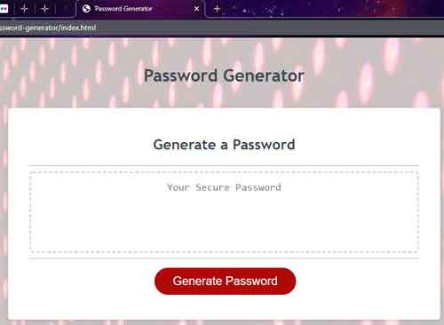
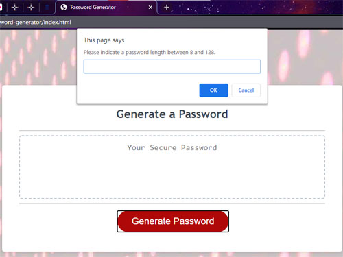
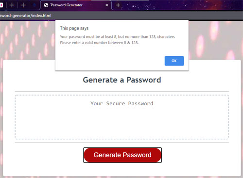
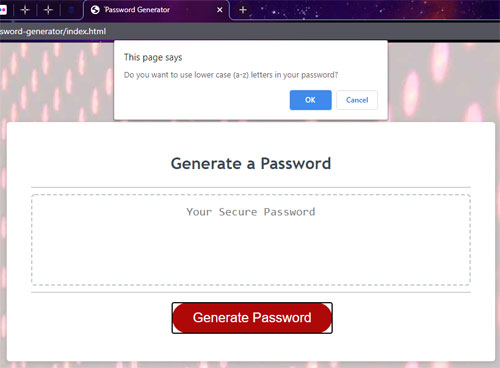
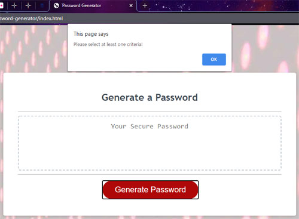
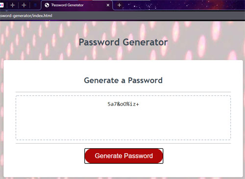

## 📚 Educational Project

This project was completed as part of [University of Arizona Full-Stack Web Development Bootcamp] to demonstrate understanding of specific concepts like: HTML, CSS, & JavaScript.

**Status:** Archived - No longer under active development
**Purpose:** Portfolio demonstration of technical concepts
**Completed:** November 2020

---

# password-generator

The purpose of this project is to create an application that an employee can use to generate a random password based on criteria they’ve selected. This sort of application or web page is commonly in use on secure websites so having an understanding of how to build and execute such an app is important.

## Motivation / Project Criteria

As per the user's request below, this application has been developed to help with the generation and usage of random passwords. The user has access to sensitive data and needs a means of creating strong passwords ensuring greater security.

GIVEN I need a new, secure password 
WHEN I click the button to generate a password 
[x]  I am presented with a series of prompts for password criteria 
WHEN prompted for password criteria 
[x] I select which criteria to include in the password 
WHEN prompted for the length of the password 
[x] I choose a length of at least 8 characters and no more than 128 characters 
WHEN prompted for character types to include in the password 
[x] I choose lowercase, uppercase, numeric, and/or special characters 
WHEN I answer each prompt 
[x] my input should be validated and at least one character type should be selected 
WHEN all prompts are answered 
[x] a password is generated that matches the selected criteria 
WHEN the password is generated 
[x] the password is either displayed in an alert or written to the page

## Approach

To complete the project, a web interface was developed with HTML (provided). This interface is formatted using CSS to give a polished look and feel that remained user friendly. The interface is powered by JavaScript. JavaScript was used to create prompts for the password length to be indicated and character types (small letters, capital letters, numbers, and symbols/special characters) selected by the user. 

The user must input their desired password length, and it must be no more than 128 characters but no less than 8 in length. The program will validate this criteria is met before allowing the user to select character types to use for the password. If the criteria is not met, the user will have to initiate the password generation again.

Once the length requirements are confirmed, the program will then prompt the user to select the desired character types to be used in generating the new password. The options presented to the user are lower case letters (shown below), capital letters, numbers and special characters/symbols. The user can opt to use any combination of one, some, or all of the character types; however they must select at least one type. Failure to select at least one character type will result in an error and require the user to select criteria before proceeding

Once these prompts are completed, the JavaScript then randomly selects and assembles enough desired characters to produce and display to the interface a password that is adequate in length and contains indicated character types.

## Link

This app can be accessed at https://treegee73.github.io/password-generator/

## Credits
Background image is a free to use image that was obtained from Pexels.com.
